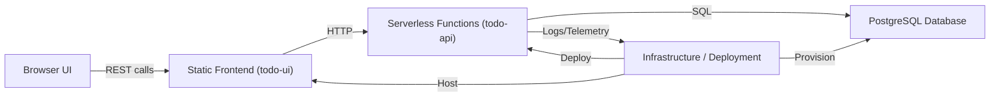
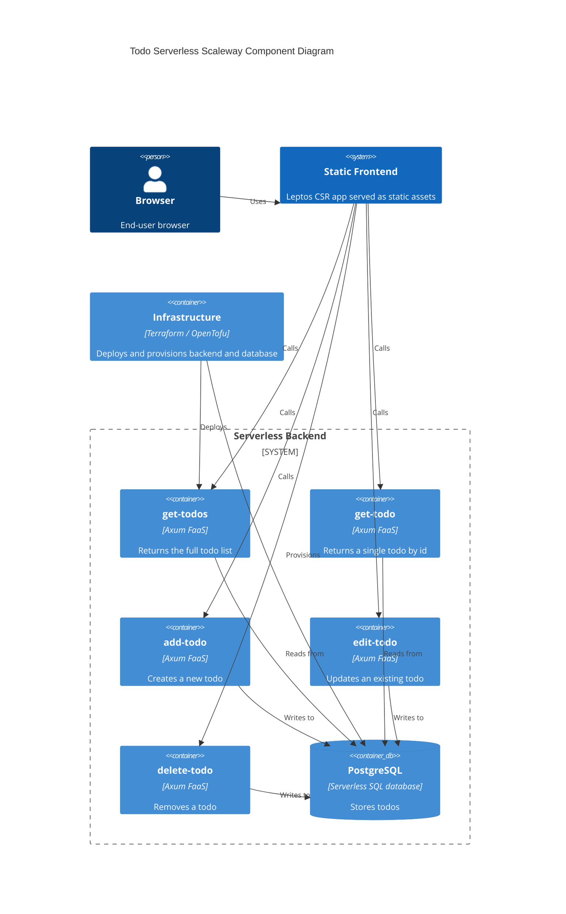
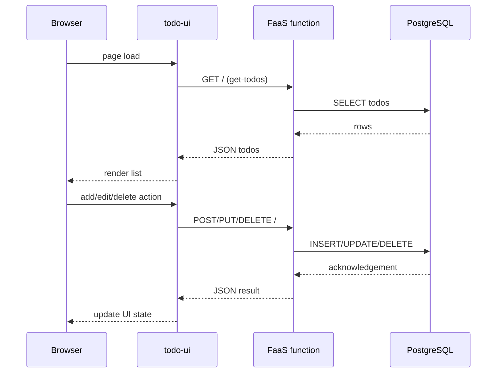

# Todo Serverless Scaleway Architecture

## Overview

This project is a Rust-based serverless Todo application built as a proof-of-concept for Scaleway.
It consists of a Leptos client-side UI, Rust-based serverless CRUD functions, a PostgreSQL persistence layer, and infrastructure defined with OpenTofu/Terraform.

## High-Level Components

- `todo-ui`
  - Leptos CSR frontend compiled to static assets.
  - Runs in the browser and talks to backend FaaS endpoints directly.
  - Uses `reqwest` to call CRUD endpoints.

- `todo-api`
  - Backend service layer implemented as five separate FaaS binaries:
    - `get-todos`
    - `get-todo`
    - `add-todo`
    - `edit-todo`
    - `delete-todo`
  - Each function exposes a single HTTP entrypoint and shares common service/repository code.

- PostgreSQL Database
  - Serverless SQL database schema is defined in `infrastructure/postgres/init.sql`.
  - Tables and queries are managed through `sqlx` in `todo-api/src/repository/todo_repository.rs`.

- Infrastructure
  - `iac/` contains OpenTofu/Terraform scripts for Scaleway resources.
  - `docker-compose.yaml` enables local development with PostgreSQL and five function containers.

## Component Responsibilities

### Frontend (`todo-ui`)

- `src/main.rs`
  - Boots the Leptos application and mounts `<App/>` to the browser.

- `src/components/app.rs`
  - Manages application state: todo list, modal visibility, current edit item.
  - Fetches todo data on start and updates state after create/update/delete.

- `src/service/todo_service.rs`
  - Defines network behavior for:
    - `get_todos()`
    - `insert_todo()`
    - `edit_todo()`
    - `delete_todo()`
  - Uses environment variables to configure endpoint URLs:
    - `URL_FAAS_GET_ALL`
    - `URL_FAAS_ADD`
    - `URL_FAAS_EDIT`
    - `URL_FAAS_DELETE`
  - Defaults to local ports `8081`, `8083`, `8084`, `8085`.

### Backend (`todo-api`)

- `src/bin/faas/*.rs`
  - Each binary creates an Axum `Router` with a single route at `/`.
  - Uses CORS middleware to allow any origin, method, and headers.
  - Connects to a PostgreSQL database using `DATABASE_URL`.
  - Delegates business operations to `todo_api::service::todo_service`.

- `src/service/todo_service.rs`
  - Contains shared application logic for CRUD operations.
  - Converts domain data into JSON values and handles errors.
  - Uses `TodoRepository` for persistence.

- `src/repository/todo_repository.rs`
  - Implements SQL CRUD against `todo.todo`.
  - Queries:
    - `get_all()`
    - `get_todo(id)`
    - `insert_todo(todo)`
    - `update_todo(todo)`
    - `delete_todo(id)`

- `src/models/mod.rs`
  - Defines the domain model types:
    - `Status` enum (`Active`, `Completed`)
    - `NewTodo`
    - `EditTodo`
    - `Todo`
  - Uses `uuid`, `chrono`, `serde`, and `sqlx` derive macros.

- `src/service/faas_service.rs`
  - Configures `tracing` for structured logging and diagnostics.

## Interfaces

### Public HTTP Interfaces

The backend functions expose simple REST-style endpoints. Each service listens on `/` and uses HTTP method semantics:

- `GET /` for list or query by ID (via query string)
- `POST /` to create a new todo
- `PUT /` to update an existing todo
- `DELETE /?id=<uuid>` to remove a todo

In local development, the default ports are:

- `8081` → get all todos
- `8082` → get todo by id
- `8083` → add todo
- `8084` → edit todo
- `8085` → delete todo

### Internal Interfaces

- Frontend → Backend
  - `TodoService` calls FaaS endpoints directly.
  - The frontend does not share domain code with the backend beyond JSON models.

- Backend Service → Repository
  - `todo_service` calls `TodoRepository` with a `PgPool`.
  - The repository is responsible for SQL binding and marshaling.

- Deployment / Infrastructure
  - `iac/` provisions environment resources and wiring for Scaleway.
  - `docker-compose.yaml` wires local service containers using `DATABASE_URL`.

## Data Flow

1. User opens the static frontend served from object storage.
2. `<App/>` loads and calls `TodoService::get_todos()`.
3. `TodoService` sends HTTP GET to the `get-todos` function.
4. `get-todos` connects to PostgreSQL and executes `SELECT ... FROM todo.todo`.
5. The backend returns JSON, and the UI renders the list.
6. Create/update/delete actions are sent to corresponding FaaS endpoints.
7. Each FaaS function writes or updates the database through `TodoRepository`.

## Deployment Model

- Backend is packaged as containerized serverless functions.
- The UI is built as a static site and can be stored in S3-compatible object storage.
- PostgreSQL runs as a managed serverless SQL instance on Scaleway.
- OpenTofu/Terraform provisions the following resources:
  - serverless SQL database
  - serverless container registry and functions
  - object storage bucket for the frontend
  - IAM/application credentials

## Local Development

- `docker-compose.yaml` runs:
  - `db` PostgreSQL service
  - `get-all`, `get`, `add`, `edit`, `delete` backend services
- Local services use `postgres://user:password@db:5432/todo-db`.
- The frontend can be served locally via `trunk` or another static server.

## Trade-offs and Design Notes

- Separate binary per CRUD operation
  - Pros: fine-grained serverless scaling, independent resource sizing.
  - Cons: more deployment artifacts, duplicated HTTP wiring, higher cold-start surface.

- Root `/` route for all endpoints
  - Simplifies each function, but makes API discovery less explicit than REST paths.

- Static frontend + direct function calls
  - Good for a simple POC and static hosting.
  - Requires explicit CORS and separate endpoint configuration.

- Single SQL store
  - Provides transactional integrity and simple persistence.
  - Does not currently support event-driven analytics or advanced scaling patterns.

## Recommended Evolution

- Consolidate the backend into a single API service or add an API gateway
- Introduce authentication and authorization for user-specific todos
- Add explicit REST paths like `/todos`, `/todos/{id}`
- Add request validation and structured error responses
- Add a monitoring/analytics pipeline for backend usage and performance
- Consider a shared API contract or generated client for stronger frontend/backend coupling

## Current Project Scope

This architecture document describes the existing todo application only. It does not currently include user registration, authentication, payment processing, or analytics subsystems.
