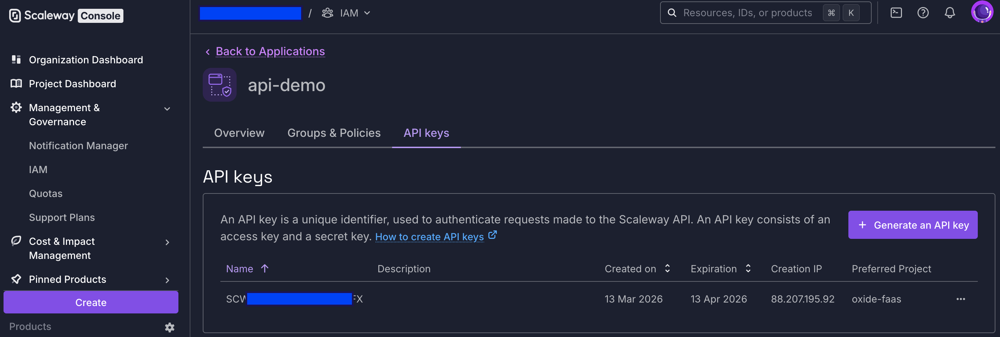
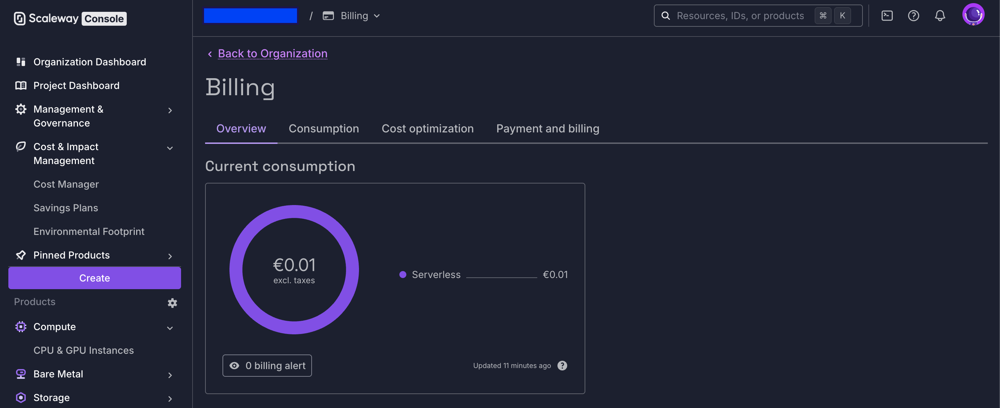

# Todo Serverless Scaleway

```
ATTENTION:

Still under construction !!!
```

## Motivation

Serverless and Rust are some of the topics to motivate me for doing POC's as in real life projects these topics are still not common practice. An other topic currently handles the IT world is European Sovereign Cloud. One actor for this is https://www.scaleway.com

The perfect moment to create a new POC, and move my AWS Serverless project https://github.com/oxide-byte/todo-serverless to a new European Cloud Provider.

Objectives:

* Serverless Functions in Backend (Rust)
* S3 Static Web Pages in Frontend (Rust / Leptos)
* Serverless Database (PostgreSQL)
* IAC - OpenTofu / Terraform

```
ATTENTION:

Deploying this POC with it's functions and database generate costs !!!
```

## General best practices when working with a Cloud Provider

*** RULE 1 ***

Apply MultiFactor Authentication (MFA) on your main account.

*** RULE 2 ***

Don't use your main account for daily business or POC's like this. It is easier to delete an "WORKER" account when its credentials are compromised. (https://www.scaleway.com/en/docs/iam/how-to/create-application/)



*** RULE 3 ***

Don't commit productive/cloud accounts, keys or passwords.

*** RULE 4 ***

Define your Budget plan with alerts:



*** RULE 5 ***

Clean up when finished. Remove all unused resources.

## Preparation

Creating a new account on https://www.scaleway.com

Sample of prices:

- https://www.scaleway.com/en/pricing/containers/
- https://www.scaleway.com/en/pricing/serverless/
- https://www.scaleway.com/en/pricing/managed-databases/#serverless-sql-database

### Accounts


### Scaleway CLI

Installation: https://www.scaleway.com/en/cli/

### Build

as mentioned, I use OpenTofu / Terraform

*** Initial Environment ***

```bash
export TF_VAR_access_key=<scw-access-key>
export TF_VAR_secret_key=<scw-secret-key>
export TF_VAR_project_id=<scw-project-id>
```

```bash
cd iac
tofu init
```

```bash
tofu plan
```

```bash
tofu apply
```

```bash
tofu destroy
```

## References:

- https://github.com/scaleway/serverless-examples/blob/main/containers/rust-hello-world/README.md